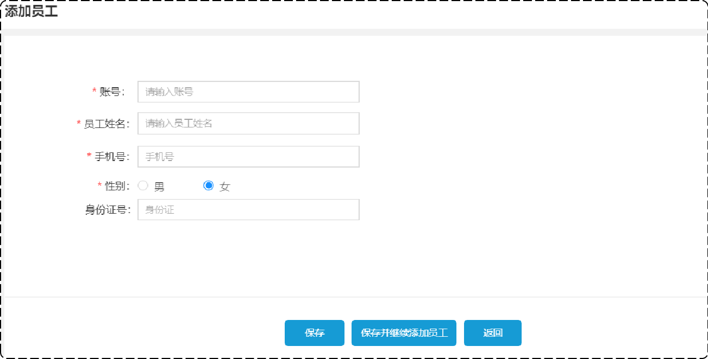
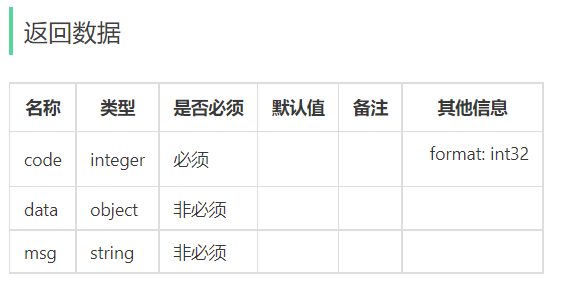
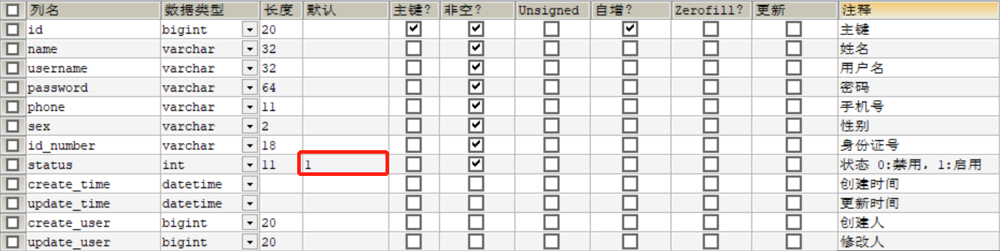
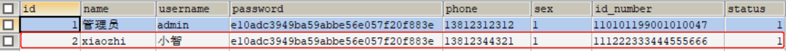

# 苍穹外卖-day02

## 课程内容

- 新增员工
- 员工分页查询
- 启用禁用员工账号
- 编辑员工
- 导入分类模块功能代码


**功能实现：**员工管理、菜品分类管理。

**员工管理效果：**

 


**菜品分类管理效果：**

 


## 1. 新增员工

### 1.1 需求分析和设计

#### 1.1.1 产品原型

一般在做需求分析时，往往都是对照着产品原型进行分析，因为产品原型比较直观，便于我们理解业务。

后台系统中可以管理员工信息，通过新增员工来添加后台系统用户。

**新增员工原型：**

 


当填写完表单信息, 点击"保存"按钮后, 会提交该表单的数据到服务端, 在服务端中需要接受数据, 然后将数据保存至数据库中。

**注意事项：**

1. 账号必须是唯一的
2. 手机号为合法的11位手机号码
3. 身份证号为合法的18位身份证号码
4. 密码默认为123456


#### 1.1.2 接口设计

找到资料-->项目接口文档-->苍穹外卖-管理端接口.html

 

明确新增员工接口的**请求路径、请求方式、请求参数、返回数据**。


本项目约定：

- **管理端**发出的请求，统一使用**/admin**作为前缀。
- **用户端**发出的请求，统一使用**/user**作为前缀。


#### 1.1.3 表设计

新增员工，其实就是将我们新增页面录入的员工数据插入到employee表。

**employee表结构：**

| **字段名**  | **数据类型** | **说明**     | **备注**    |
| ----------- | ------------ | ------------ | ----------- |
| id          | bigint       | 主键         | 自增        |
| name        | varchar(32)  | 姓名         |             |
| username    | varchar(32)  | 用户名       | 唯一        |
| password    | varchar(64)  | 密码         |             |
| phone       | varchar(11)  | 手机号       |             |
| sex         | varchar(2)   | 性别         |             |
| id_number   | varchar(18)  | 身份证号     |             |
| status      | Int          | 账号状态     | 1正常 0锁定 |
| create_time | Datetime     | 创建时间     |             |
| update_time | datetime     | 最后修改时间 |             |
| create_user | bigint       | 创建人id     |             |
| update_user | bigint       | 最后修改人id |             |

其中，employee表中的status字段已经设置了默认值1，表示状态正常。

  


### 1.2 代码开发

#### 1.2.1 设计DTO类

**根据新增员工接口设计对应的DTO**

前端传递参数列表：

 

**思考：**是否可以使用对应的实体类来接收呢？

 

**注意：**当前端提交的数据和实体类中对应的属性差别比较大时，建议使用DTO来封装数据

由于上述传入参数和实体类有较大差别，所以自定义DTO类。

进入sky-pojo模块，在com.sky.dto包下，已定义EmployeeDTO

```java
package com.sky.dto;

import lombok.Data;

import java.io.Serializable;

@Data
public class EmployeeDTO implements Serializable {

    private Long id;

    private String username;

    private String name;

    private String phone;

    private String sex;

    private String idNumber;

}
```


#### 1.2.2 Controller层

 **EmployeeController中创建新增员工方法**

进入到sky-server模块中，在com.sky.controller.admin包下，在EmployeeController中创建新增员工方法，接收前端提交的参数。

```java
	/**
     * 新增员工
     * @param employeeDTO
     * @return
     */
    @PostMapping
    @ApiOperation("新增员工")
    public Result save(@RequestBody EmployeeDTO employeeDTO){
        log.info("新增员工：{}",employeeDTO);
        employeeService.save(employeeDTO);//该方法后续步骤会定义
        return Result.success();
    }
```

**注：**Result类定义了后端统一返回结果格式。

进入sky-common模块，在com.sky.result包下定义了Result.java

```java
package com.sky.result;

import lombok.Data;

import java.io.Serializable;

/**
 * 后端统一返回结果
 * @param <T>
 */
@Data
public class Result<T> implements Serializable {

    private Integer code; //编码：1成功，0和其它数字为失败
    private String msg; //错误信息
    private T data; //数据

    public static <T> Result<T> success() {
        Result<T> result = new Result<T>();
        result.code = 1;
        return result;
    }

    public static <T> Result<T> success(T object) {
        Result<T> result = new Result<T>();
        result.data = object;
        result.code = 1;
        return result;
    }

    public static <T> Result<T> error(String msg) {
        Result result = new Result();
        result.msg = msg;
        result.code = 0;
        return result;
    }

}
```


#### 1.2.3 Service层接口

**在EmployeeService接口中声明新增员工方法**

进入到sky-server模块中,com.sky.server.EmployeeService

```java
	/**
     * 新增员工
     * @param employeeDTO
     */
    void save(EmployeeDTO employeeDTO);
```


#### 1.2.4 Service层实现类

**在EmployeeServiceImpl中实现新增员工方法**

com.sky.server.impl.EmployeeServiceImpl中创建方法

```java
	/**
     * 新增员工
     *
     * @param employeeDTO
     */
    public void save(EmployeeDTO employeeDTO) {
        Employee employee = new Employee();

        //对象属性拷贝
        BeanUtils.copyProperties(employeeDTO, employee);

        //设置账号的状态，默认正常状态 1表示正常 0表示锁定
        employee.setStatus(StatusConstant.ENABLE);

        //设置密码，默认密码123456
        employee.setPassword(DigestUtils.md5DigestAsHex(PasswordConstant.DEFAULT_PASSWORD.getBytes()));

        //设置当前记录的创建时间和修改时间
        employee.setCreateTime(LocalDateTime.now());
        employee.setUpdateTime(LocalDateTime.now());

        //设置当前记录创建人id和修改人id
        employee.setCreateUser(10L);//目前写个假数据，后期修改
        employee.setUpdateUser(10L);

        employeeMapper.insert(employee);//后续步骤定义
    }
```


在sky-common模块com.sky.constants包下已定义StatusConstant.java

```java
package com.sky.constant;

/**
 * 状态常量，启用或者禁用
 */
public class StatusConstant {

    //启用
    public static final Integer ENABLE = 1;

    //禁用
    public static final Integer DISABLE = 0;
}

```


#### 1.2.5 Mapper层

**在EmployeeMapper中声明insert方法**

com.sky.EmployeeMapper中添加方法

```java
	/**
     * 插入员工数据
     * @param employee
     */
    @Insert("insert into employee (name, username, password, phone, sex, id_number, create_time, update_time, create_user, update_user,status) " +
            "values " +
            "(#{name},#{username},#{password},#{phone},#{sex},#{idNumber},#{createTime},#{updateTime},#{createUser},#{updateUser},#{status})")
    void insert(Employee employee);
```


在application.yml中已开启驼峰命名，故id_number和idNumber可对应。

```yaml
mybatis:
  configuration:
    #开启驼峰命名
    map-underscore-to-camel-case: true
```


### 1.3 功能测试

代码已经发开发完毕，对新增员工功能进行测试。

**功能测试实现方式：**

- 通过接口文档测试
- 通前后端联调测试

接下来我们使用上述两种方式分别测试。


#### 1.3.1 接口文档测试

**启动服务：**访问http://localhost:8080/doc.html，进入新增员工接口

   

json数据：

```json
{
  "id": 0,
  "idNumber": "111222333444555666",
  "name": "xiaozhi",
  "phone": "13812344321",
  "sex": "1",
  "username": "小智"
}
```

响应码：401 报错

**通过断点调试：**进入到JwtTokenAdminInterceptor拦截器

```java
 	/**
     * 校验jwt
     *
     * @param request
     * @param response
     * @param handler
     * @return
     * @throws Exception
     */
    public boolean preHandle(HttpServletRequest request, HttpServletResponse response, Object handler) throws Exception {
        //判断当前拦截到的是Controller的方法还是其他资源
        if (!(handler instanceof HandlerMethod)) {
            //当前拦截到的不是动态方法，直接放行
            return true;
        }

        //1、从请求头中获取令牌 jwtProperties.getAdminTokenName()获取为token
        String token = request.getHeader(jwtProperties.getAdminTokenName());

        //2、校验令牌
        try {
            log.info("jwt校验:{}", token);
            Claims claims = JwtUtil.parseJWT(jwtProperties.getAdminSecretKey(), token);
            Long empId = Long.valueOf(claims.get(JwtClaimsConstant.EMP_ID).toString());
            log.info("当前员工id：", empId);
            //3、通过，放行
            return true;
        } catch (Exception ex) {
            //4、不通过，响应401状态码
            response.setStatus(401);
            return false;
        }
    }
```

**报错原因：**由于JWT令牌校验失败，导致EmployeeController的save方法没有被调用

**解决方法：**调用员工登录接口获得一个合法的JWT令牌

使用admin用户登录获取令牌

 

**添加令牌：**

将合法的JWT令牌添加到全局参数中

文档管理-->全局参数设置-->添加参数

 

**接口测试：**


 

其中，请求头部含有JWT令牌

 

**查看employee表：**



测试成功。


#### 1.3.2 前后端联调测试

启动nginx,访问 http://localhost

登录-->员工管理-->添加员工

 

保存后，查看employee表

 

测试成功。


**注意：**由于开发阶段前端和后端是并行开发的，后端完成某个功能后，此时前端对应的功能可能还没有开发完成，
导致无法进行前后端联调测试。所以在开发阶段，后端测试主要以接口文档测试为主。


### 1.4 代码完善

目前，程序存在的问题主要有两个：

- 录入的用户名已存，抛出的异常后没有处理
- 新增员工时，创建人id和修改人id设置为固定值

接下来，我们对上述两个问题依次进行分析和解决。


#### 1.4.1 问题一

**描述：**录入的用户名已存，抛出的异常后没有处理

**分析：**

新增username=zhangsan的用户，若employee表中之前已存在。

 

后台报错信息：

 

查看employee表结构：

 

发现，username已经添加了唯一约束，不能重复。

**解决：**

通过全局异常处理器来处理。

进入到sky-server模块，com.sky.hander包下，GlobalExceptionHandler.java添加方法

```java
	/**
     * 处理SQL异常
     * @param ex
     * @return
     */
    @ExceptionHandler
    public Result exceptionHandler(SQLIntegrityConstraintViolationException ex){
        //Duplicate entry 'zhangsan' for key 'employee.idx_username'
        String message = ex.getMessage();
        if(message.contains("Duplicate entry")){
            String[] split = message.split(" ");
            String username = split[2];
            String msg = username + MessageConstant.ALREADY_EXISTS;
            return Result.error(msg);
        }else{
            return Result.error(MessageConstant.UNKNOWN_ERROR);
        }
    }
```

进入到sky-common模块，在MessageConstant.java添加

```java
public static final String ALREADY_EXISTS = "已存在";
```

再次，接口测试：

 


####  1.4.2 问题二

**描述**：新增员工时，创建人id和修改人id设置为固定值

**分析：**

```java
	/**
     * 新增员工
     *
     * @param employeeDTO
     */
    public void save(EmployeeDTO employeeDTO) {
        Employee employee = new Employee();
        //................
        //////////当前设置的id为固定值10//////////
        employee.setCreateUser(10L);
        employee.setUpdateUser(10L);
        //////////////////////////////////////
        //.................................

        employeeMapper.insert(employee);//后续步骤定义
    }
```

**解决：**

通过某种方式动态获取当前登录员工的id。

 

员工登录成功后会生成JWT令牌并响应给前端：

在sky-server模块

```java
package com.sky.controller.admin;
/**
 * 员工管理
 */
@RestController
@RequestMapping("/admin/employee")
@Slf4j
@Api(tags = "员工相关接口")
public class EmployeeController {

    @Autowired
    private EmployeeService employeeService;
    @Autowired
    private JwtProperties jwtProperties;

    /**
     * 登录
     *
     * @param employeeLoginDTO
     * @return
     */
    @PostMapping("/login")
    @ApiOperation(value = "员工登录")
    public Result<EmployeeLoginVO> login(@RequestBody EmployeeLoginDTO employeeLoginDTO) {
        //.........

        //登录成功后，生成jwt令牌
        Map<String, Object> claims = new HashMap<>();
        claims.put(JwtClaimsConstant.EMP_ID, employee.getId());
        String token = JwtUtil.createJWT(
                jwtProperties.getAdminSecretKey(),
                jwtProperties.getAdminTtl(),
                claims);

        //............

        return Result.success(employeeLoginVO);
    }

}
```

后续请求中，前端会携带JWT令牌，通过JWT令牌可以解析出当前登录员工id：

JwtTokenAdminInterceptor.java

```java
package com.sky.interceptor;

/**
 * jwt令牌校验的拦截器
 */
@Component
@Slf4j
public class JwtTokenAdminInterceptor implements HandlerInterceptor {

    @Autowired
    private JwtProperties jwtProperties;

    /**
     * 校验jwt
     *
     * @param request
     * @param response
     * @param handler
     * @return
     * @throws Exception
     */
    public boolean preHandle(HttpServletRequest request, HttpServletResponse response, Object handler) throws Exception {
       
		//..............
        
        //1、从请求头中获取令牌
        String token = request.getHeader(jwtProperties.getAdminTokenName());

        //2、校验令牌
        try {
            log.info("jwt校验:{}", token);
            Claims claims = JwtUtil.parseJWT(jwtProperties.getAdminSecretKey(), token);
            Long empId = Long.valueOf(claims.get(JwtClaimsConstant.EMP_ID).toString());
            log.info("当前员工id：", empId);
            //3、通过，放行
            return true;
        } catch (Exception ex) {
            //4、不通过，响应401状态码
            response.setStatus(401);
            return false;
        }
    }
}
```

**思考：**解析出登录员工id后，如何传递给Service的save方法？

通过ThreadLocal进行传递。


#### 1.4.3 ThreadLocal

**介绍：**

ThreadLocal 并不是一个Thread，而是Thread的局部变量。
ThreadLocal为每个线程提供单独一份存储空间，具有线程隔离的效果，只有在线程内才能获取到对应的值，线程外则不能访问。

**常用方法：**

- public void set(T value) 	设置当前线程的线程局部变量的值
- public T get() 		返回当前线程所对应的线程局部变量的值
- public void remove()        移除当前线程的线程局部变量

对ThreadLocal有了一定认识后，接下来继续解决**问题二**

 

初始工程中已经封装了 ThreadLocal 操作的工具类：

在sky-common模块

```java
package com.sky.context;

public class BaseContext {

    public static ThreadLocal<Long> threadLocal = new ThreadLocal<>();

    public static void setCurrentId(Long id) {
        threadLocal.set(id);
    }

    public static Long getCurrentId() {
        return threadLocal.get();
    }

    public static void removeCurrentId() {
        threadLocal.remove();
    }

}
```

在拦截器中解析出当前登录员工id，并放入线程局部变量中：

在sky-server模块中，拦截器：

```java
package com.sky.interceptor;

/**
 * jwt令牌校验的拦截器
 */
@Component
@Slf4j
public class JwtTokenAdminInterceptor implements HandlerInterceptor {

    @Autowired
    private JwtProperties jwtProperties;

    /**
     * 校验jwt
     *
     * @param request
     * @param response
     * @param handler
     * @return
     * @throws Exception
     */
    public boolean preHandle(HttpServletRequest request, HttpServletResponse response, Object handler) throws Exception {
        
		//.............................
       
        //2、校验令牌
        try {
            //.................
            Claims claims = JwtUtil.parseJWT(jwtProperties.getAdminSecretKey(), token);
            Long empId = Long.valueOf(claims.get(JwtClaimsConstant.EMP_ID).toString());
            log.info("当前员工id：", empId);
            /////将用户id存储到ThreadLocal////////
            BaseContext.setCurrentId(empId);
            ////////////////////////////////////
            //3、通过，放行
            return true;
        } catch (Exception ex) {
            //......................
        }
    }
}
```

在Service中获取线程局部变量中的值：

```java
	/**
     * 新增员工
     *
     * @param employeeDTO
     */
    public void save(EmployeeDTO employeeDTO) {
        //.............................

        //设置当前记录创建人id和修改人id
        employee.setCreateUser(BaseContext.getCurrentId());//目前写个假数据，后期修改
        employee.setUpdateUser(BaseContext.getCurrentId());

        employeeMapper.insert(employee);
    }
```

测试：使用admin(id=1)用户登录后添加一条记录

 

查看employee表记录

 


### 1.5 代码提交

点击提交：

 

提交过程中，出现提示：

 

继续push:

 

推送成功：

 
hhhhhhh